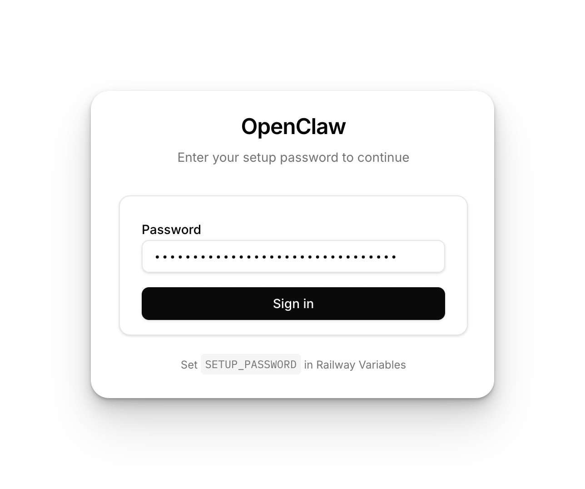
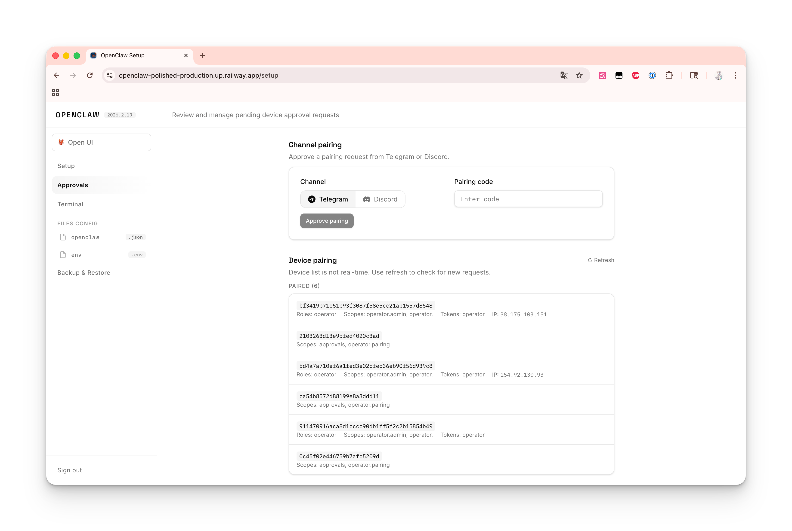

# OpenClaw Polished — Railway Template

A polished fork of the [OpenClaw Railway Template](https://github.com/vignesh07/openclaw-railway-template), featuring a modern React-based Setup UI and improved reverse proxy reliability.

## Screenshots

| Login | Setup |
|:---:|:---:|
|  |  |

## What's different from upstream

- **Modern Setup UI** — React + Tailwind CSS, shadcn/ui-inspired design with sidebar navigation
- **Custom login page** — replaces browser Basic Auth popup with a styled login form
- **Monaco Editor** — VS Code-grade JSON editor for config, with syntax highlighting and auto-format
- **Radix UI selects** — searchable combobox for console commands, rich dropdowns with descriptions for providers
- **Proxy improvements** — 502 error responses instead of hanging connections, sync fast-path for hot requests
- **Auto-restart** — gateway crashes trigger automatic restart with exponential backoff
- **Graceful shutdown** — `restartGateway` properly waits for process exit with SIGKILL fallback
- **Auto-generated password** — if `SETUP_PASSWORD` is not set, a secure random password is generated and logged
- **Unified config** — removed legacy `CLAWDBOT_*` env var migration, only `OPENCLAW_*` is supported
- **Always on main** — builds from OpenClaw `main` branch, no pinned version

## What you get

- **OpenClaw Gateway + Control UI** at `/` and `/openclaw`
- **Setup Wizard** at `/setup` with provider selection, channel config, and debug console
- **Persistent state** via Railway Volume (config/credentials survive redeploys)
- **Export / Import backup** from the Setup UI

## How it works

1. The container runs an Express wrapper server on port 8080
2. `/setup` serves the React SPA — authentication is handled in the UI via API calls
3. The wizard runs `openclaw onboard --non-interactive` and writes config to the volume
4. After setup, all non-setup traffic is reverse-proxied to the internal gateway (including WebSockets)

## Deploy on Railway

[](https://railway.com/deploy/-fU_Ch?referralCode=xBN1Uf&utm_medium=integration&utm_source=template&utm_campaign=generic)

1. Create a new template from this repo
2. Add a **Volume** mounted at `/data`
3. Set variables:

| Variable | Required | Description |
|---|---|---|
| `SETUP_PASSWORD` | Recommended | Password for `/setup`. If not set, a random one is generated and printed in logs |
| `OPENCLAW_STATE_DIR` | Yes | Set to `/data/.openclaw` |
| `OPENCLAW_WORKSPACE_DIR` | Yes | Set to `/data/workspace` |
| `OPENCLAW_GATEWAY_TOKEN` | Optional | Stable token for gateway auth. Auto-generated if not set |

4. Enable **Public Networking** (HTTP) — listens on port `8080`
5. Deploy, then visit `https://<your-app>.up.railway.app/setup`

## Local development

### Backend + Frontend (full stack)

```bash
# Install dependencies
npm install
cd ui && npm install && cd ..

# Terminal 1 — backend (project root)
SETUP_PASSWORD=test node src/server.js

# Terminal 2 — frontend dev server
cd ui && npm run dev
```

Open `http://localhost:5173/setup` and sign in with `test`.

### Build UI only

```bash
npm run build:ui
```

### Docker

```bash
docker build -t openclaw-polished .

docker run --rm -p 8080:8080 \
  -e OPENCLAW_STATE_DIR=/data/.openclaw \
  -e OPENCLAW_WORKSPACE_DIR=/data/workspace \
  -v $(pwd)/.tmpdata:/data \
  openclaw-polished
```

Check logs for the generated `SETUP_PASSWORD`, then open `http://localhost:8080/setup`.

## Troubleshooting

### "disconnected (1008): pairing required"

Not a crash — the gateway is running but no device has been approved.

Fix: open `/setup` → Console → run `openclaw devices list`, then `openclaw devices approve <requestId>`.

### "unauthorized: gateway token mismatch"

The Control UI token doesn't match the gateway token.

Fix: re-run setup from `/setup`, or manually set both `gateway.auth.token` and `gateway.remote.token` to the same value in the config editor.

### 502 Bad Gateway

The wrapper is up but the gateway can't start.

Checklist:
- Volume mounted at `/data` with `OPENCLAW_STATE_DIR=/data/.openclaw` and `OPENCLAW_WORKSPACE_DIR=/data/workspace`
- Public Networking enabled, `PORT=8080`
- Check `/healthz` for diagnostics
- Check `/setup` → Console → `openclaw doctor`

### Build OOM

Building OpenClaw from source needs memory. Use a Railway plan with 2GB+ RAM.

## Credits

Forked from [openclaw-railway-template](https://github.com/vignesh07/openclaw-railway-template) by **Vignesh N (@vignesh07)**.
